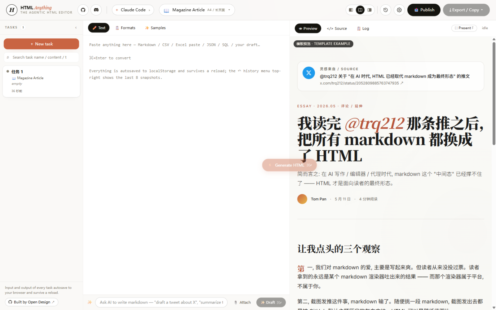
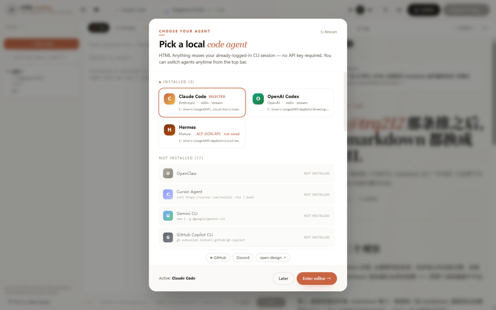
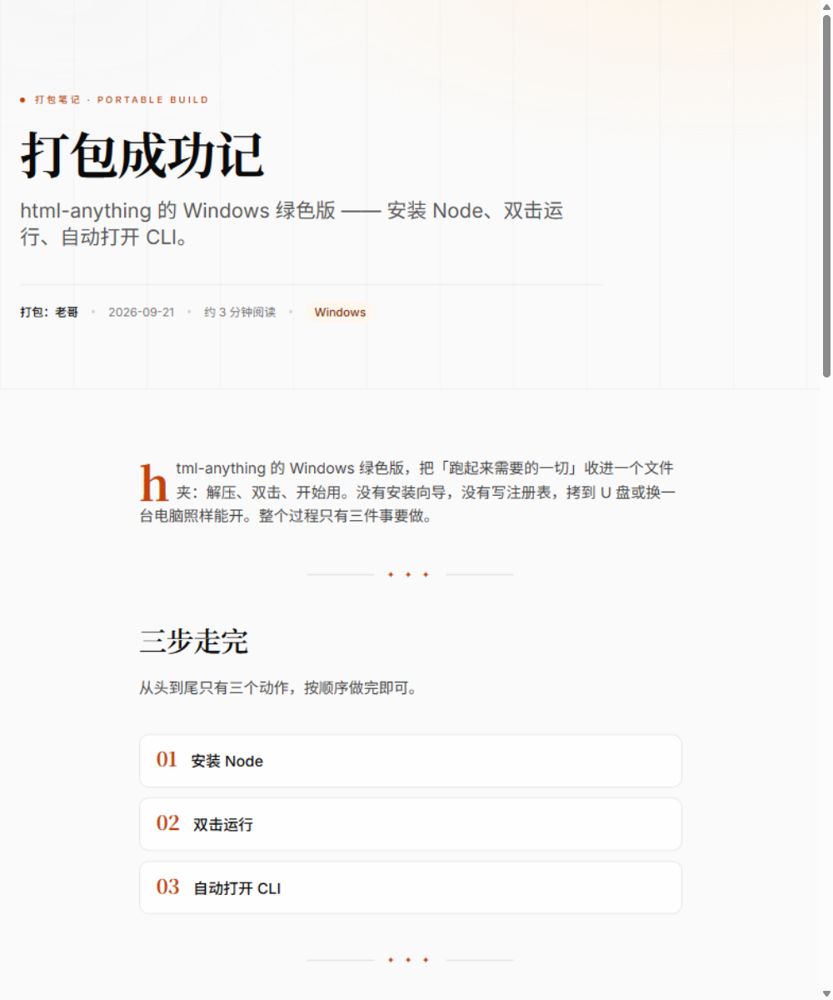

<div align="center">

# HTML Anything 桌面版

**免装 Node、不碰终端 —— 双击即用的本地 AI 网页排版工坊**

[](https://github.com/Geerdan1995/html-anything-desktop/releases)
[](https://github.com/Geerdan1995/html-anything-desktop/releases)
[](LICENSE)
[](https://github.com/nexu-io/html-anything)

**简体中文** · [English](README.en.md)

[⬇ 下载最新版](https://github.com/Geerdan1995/html-anything-desktop/releases/latest)

</div>

---



## 这是什么

把 Markdown / CSV / Excel / JSON / SQL 贴进左侧，选一个排版模板，按 `Ctrl + Enter` —— 你本机已登录的 AI Agent 几秒钟就会把它变成一份精排的**单文件 HTML**，一键导出为微信公众号、知乎、X、小红书可用的格式或 PNG 图片。

本仓库是开源项目 [nexu-io/html-anything](https://github.com/nexu-io/html-anything) 的**桌面打包版**：把它变成免安装、双击即用、自动更新的 Windows 桌面应用，并通过 GitHub Actions **每日自动同步上游**、自动构建发布。

## 核心特性

### 🖥️ 真正的桌面应用

- 安装版双击安装，或绿色版解压即用
- **不需要安装 Node.js，不需要碰终端**
- 所有数据保存在本机浏览器存储里，完全本地运行

### 🤖 自动发现你的 Agent，零 API Key



启动时自动扫描本机已安装的编程 Agent CLI —— Claude Code、OpenAI Codex、Gemini CLI、Qwen Coder、Aider 等 20+ 款，**直接复用你已有的登录会话**，无需配置任何 API Key。

### 🎨 75+ 排版模板

杂志文章、演示文稿、海报、小红书图文、数据报告、推文卡片…… 模板库与上游同步，持续增加。

### ✨ 真实的生成效果



*上面这篇杂志排版文章，就是本应用调用 Codex 真实生成的产物。*

### 🔄 全自动更新，上游更新你先知

- 应用内自动检查更新（启动时 + 每 6 小时）
- 一键更新 → **差量下载（秒级）→ 静默安装 → 自动重启**，比大多数软件少一步
- 下载失败自动切换备用线路，**不开代理也能更新**
- 上游仓库一有更新，GitHub Actions 云端自动构建发布，你的应用第二天自动提示升级

## 下载安装

到 [Releases](https://github.com/Geerdan1995/html-anything-desktop/releases/latest) 页面：

| 文件 | 说明 |
| --- | --- |
| `html-anything-setup-*.exe` | **安装版（推荐）**：支持应用内自动更新 |
| `html-anything-win-x64-portable-*.zip` | 绿色版：解压后双击 `start.vbs` 即用 |

**唯一前提**：本机已安装并登录至少一个受支持的 Agent CLI（如 `claude`、`codex`、`gemini` 等）。

> 💡 应用未做代码签名，首次运行会弹 SmartScreen，点「更多信息 → 仍要运行」即可；之后的更新全部静默完成，不再提示。

## 从源码构建

```bash
git clone https://github.com/Geerdan1995/html-anything-desktop.git
cd html-anything-desktop

# 工作区依赖必须用 hoisted 模式安装（standalone 产物需要无符号链接布局）
pnpm install --node-linker=hoisted

# 构建 Next.js standalone 产物 + 组装绿色版
pnpm -F @html-anything/next build
node packaging/portable/build-portable.mjs

# 构建 Electron 安装包（产物在 dist/desktop-out/）
cd packaging/desktop && npm ci
node build-desktop.mjs
```

日常出包由 [.github/workflows/desktop-release.yml](.github/workflows/desktop-release.yml) 全自动完成：每日检查上游 → 同步 rebase → 构建 → 冒烟测试 → 发布 Release。

## 与上游的关系

本仓库 fork 自 [nexu-io/html-anything](https://github.com/nexu-io/html-anything)（Apache-2.0），对上游代码的改动**只有一行**（`next.config.ts` 启用 standalone 输出），其余全部为新增的桌面打包资产，因此可以无冲突地持续同步上游：

```
├── next/                  # 上游的 Next.js 应用（唯一改动：next.config.ts 一行）
├── packaging/
│   ├── portable/          # 绿色版：启动器 + 组装脚本
│   └── desktop/           # Electron 壳：主进程、加载页、electron-builder 配置
├── docs/screenshots/      # 本 README 的截图
└── .github/workflows/     # 每日自动同步 + 构建 + 发布流水线
```

## 许可与致谢

[Apache-2.0](LICENSE)

- 核心编辑器与模板库来自开源项目 [nexu-io/html-anything](https://github.com/nexu-io/html-anything)，感谢其团队的杰出工作
- 桌面打包壳（Electron 集成、自动更新、CI 流水线）为本仓库新增，同样以 Apache-2.0 开源
